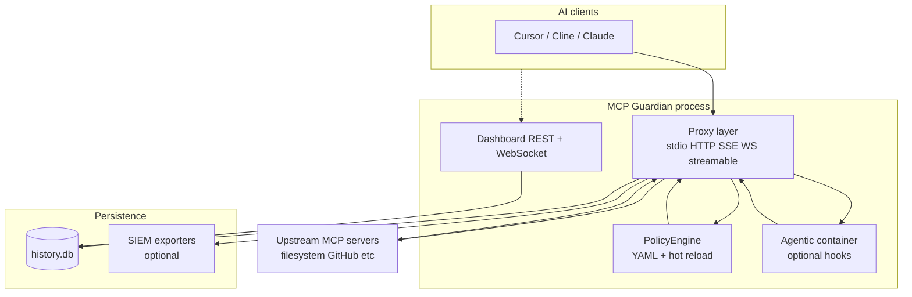
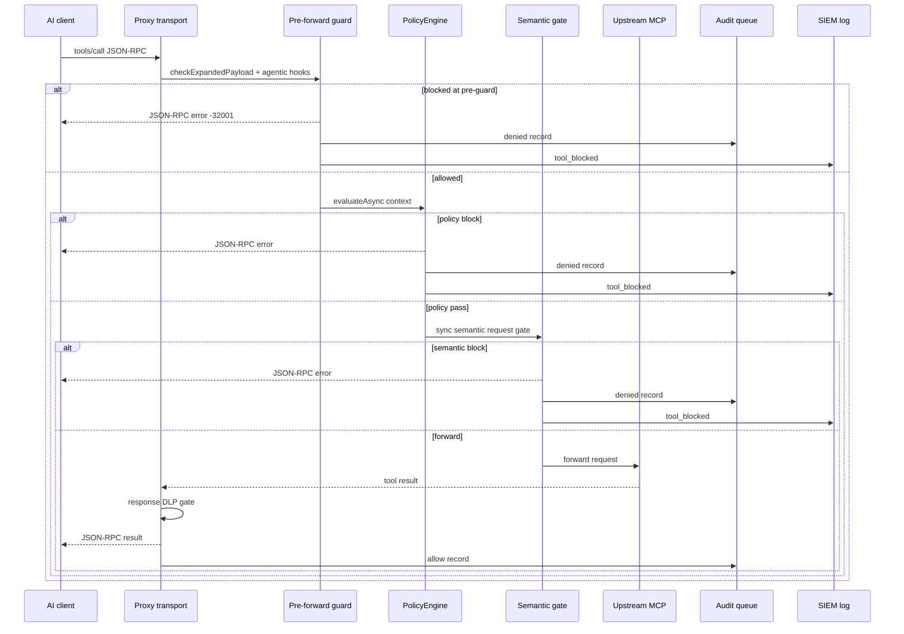
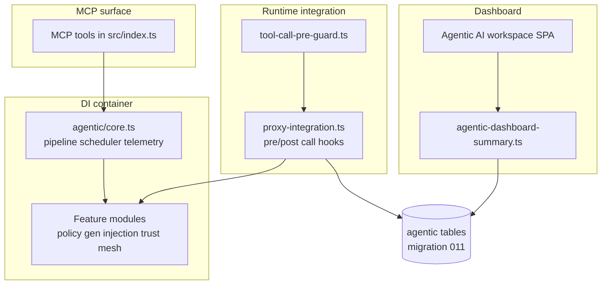
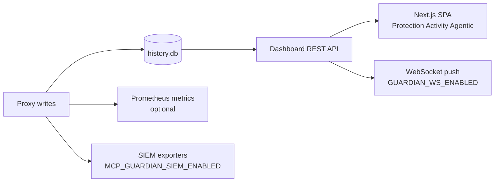
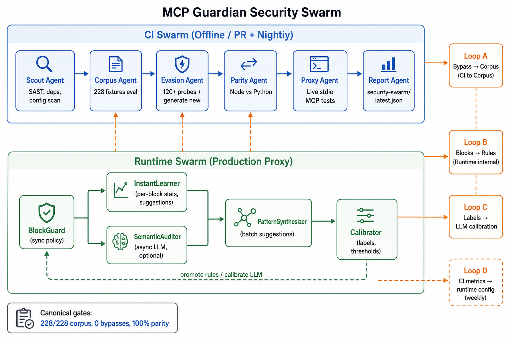
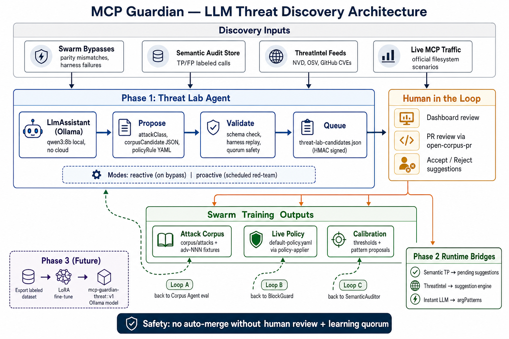
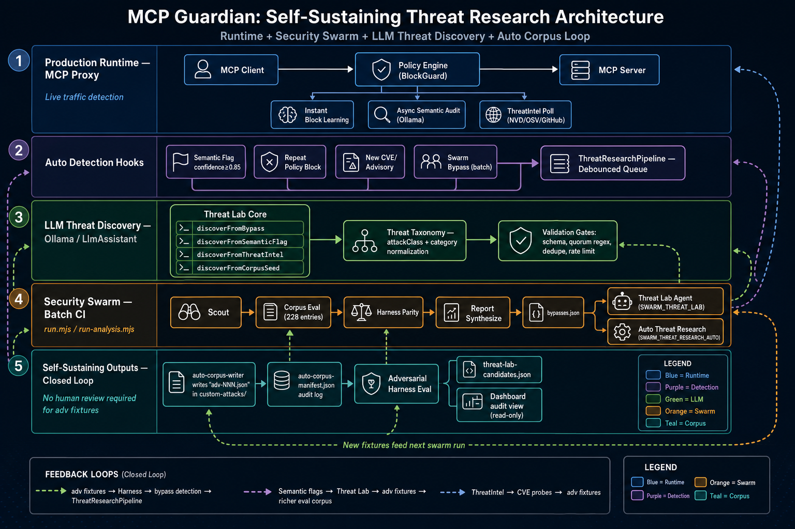
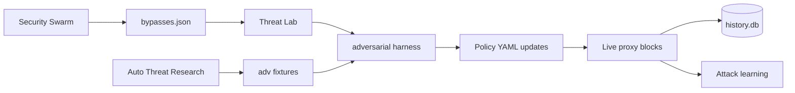

# MCP Guardian

**A safety layer between your AI assistant and the tools it uses.**

[](https://www.npmjs.com/package/@mcp-guardian/server)
[](https://www.npmjs.com/package/@mcp-guardian/server)
[](https://mcp-guardian-cloud.vercel.app/)
[](https://glama.ai/mcp/servers/rudraneel93/mcp-guardian)
[](https://www.typescriptlang.org/)
[](https://github.com/modelcontextprotocol/typescript-sdk)
[](LICENSE)
[](https://github.com/rudraneel93/mcp-guardian/actions/workflows/ci.yml)

**Version 4.0.0** · [Website](https://mcp-guardian-cloud.vercel.app) · [npm](https://www.npmjs.com/package/@mcp-guardian/server) · [Changelog](CHANGELOG.md)

### What's new in 4.0.0

**Industry-standard MCP protection** — Guardian moves from per-call filtering to fleet-wide, cross-agent security:

- **MTX v1** — open threat exchange format (`@mcp-guardian/mtx`) + cloud hub
- **Guardian Certified MCP** — HMAC attestation, persistent registry, verification API
- **Multi-step attack chains** — collusion detector + session-chain graph with proxy enforcement
- **Capability graph & intent binding** — tool/resource graph and session intent allowlists
- **Agent reputation ledger** — persistent scores with proxy enforcement
- **Dynamic sandbox tiers** — shadow / redact / allow with RL-ready persistence
- **Protocol fuzzer** — expanded corpus with real block validation and cert gates
- **Policy simulator** — `/api/policy/simulate` + `ab_test_policy` MCP tool
- **Incident playbooks & AI investigator** — webhook/isolate executors; Threat Lab–linked investigations
- **Compliance evidence runner** — live policy + audit wired to SOC2/HIPAA/PCI/FedRAMP/ISO mappings
- **guardian-bench** — `mcp-guardian bench` CLI + public leaderboard

See [CHANGELOG.md](CHANGELOG.md) for 3.4.1 production hardening (JWKS refresh, payload limits, SIEM on all block paths, audit retention).

**Roadmap (planned):** Cross-MCP causal attack chains, digital twin policy sandbox, agent behavioral biometrics, decentralized reputation network, federated threat detection, and more — [docs/AGENTIC_ROADMAP.md](docs/AGENTIC_ROADMAP.md).

---

## What problem does this solve?

Modern AI assistants (Claude, Cursor, Cline, and others) can connect to **tools** — read files, run commands, query databases, post to Slack, and more. Those connections often use a standard called **MCP** (Model Context Protocol).

That power is useful, but risky:

- The AI might read files it should not see.
- It might run shell commands or delete data by mistake or because of a malicious prompt.
- Secrets can leak through tool arguments.
- API costs can spike without you noticing.

**MCP Guardian sits in the middle.** Every tool request goes through Guardian first. Guardian checks your rules, blocks bad requests, logs what happened, and can show you a live dashboard — **before** anything reaches your real tools.

```
Your AI assistant
       │
       ▼
  MCP Guardian  ← reads your rules, blocks bad calls, keeps a log
       │
       ▼
  Your real tools (files, GitHub, database, …)
```

---

## How it works (step by step)

1. **You install Guardian** and point it at your existing MCP setup (or run `mcp-guardian onboard` to do this automatically).
2. **Guardian wraps your tool servers** so the AI talks to Guardian instead of talking to them directly.
3. When the AI tries to use a tool, Guardian receives the request first.
4. Guardian compares the request to your **policy** (a simple rules file you control).
5. If the request is allowed, Guardian forwards it to the real tool and returns the result.
6. If the request breaks a rule, Guardian **blocks it** and tells the AI it was denied — the real tool never runs.
7. Every allow and block is saved to a local database so you can review history and see charts on the dashboard.

You stay in control: Guardian does not silently change your rules unless you approve it (for example when reviewing Threat Lab suggestions).

---

## Architecture

This section shows how MCP Guardian is wired together: what runs where, how a tool call flows through governance, and how optional Pro pipelines connect to the proxy.

**In this section:** [System overview](#system-overview) · [Tool call path](#tool-call-path-tools_call) · [Transports](#transports) · [Agentic AI](#agentic-ai-integration) · [Dashboard](#dashboard-and-observability) · [Pro pipelines](#pro-pipeline-architecture) · [Learning loop](#continuous-improvement-loop)

### System overview

When you run `pnpm dashboard:proxy`, one Node process typically hosts the **policy proxy**, the **dashboard API**, and (optionally) **agentic services**. All components share the same audit database (`MCP_GUARDIAN_DB_PATH`, default `~/.mcp-guardian/history.db`).



| Component | Role | Main code |
|-----------|------|-----------|
| **Proxy layer** | Intercepts JSON-RPC; enforces policy on every `tools/call` | [`src/proxy/`](src/proxy/) |
| **Policy engine** | Evaluates YAML rules, rate limits, RBAC, patterns | [`src/policy/`](src/policy/) |
| **History DB** | Stores allow/block audit, tokens, cost | [`src/database/history-db.ts`](src/database/history-db.ts) |
| **Dashboard** | Local UI + REST API over the same DB | [`deploy/dashboard-spa/`](deploy/dashboard-spa/), [`src/utils/dashboard-server.ts`](src/utils/dashboard-server.ts) |
| **Agentic** | Smart features (injection scan, policy gen, trust, etc.) | [`src/agentic/`](src/agentic/) |

Enterprise deployments may add **Redis** (rate limits, DPoP, circuit-breaker sync) and **PostgreSQL** instead of SQLite — see [ENTERPRISE_DEPLOYMENT.md](docs/ENTERPRISE_DEPLOYMENT.md).

### Tool call path (`tools/call`)

Every dangerous decision happens **before** the real MCP server runs. If Guardian blocks a call, the upstream tool never receives it.



**Integration details:**

1. **Pre-forward guard** ([`src/proxy/tool-call-pre-guard.ts`](src/proxy/tool-call-pre-guard.ts)) — caps expanded argument size and runs agentic pre-hooks (prompt injection, etc.) on all transports.
2. **Policy** ([`src/policy/policy-engine.ts`](src/policy/policy-engine.ts)) — your YAML rules; rate-limit counters survive hot-reload via [`src/policy/rate-limit-store.ts`](src/policy/rate-limit-store.ts).
3. **Semantic gate** ([`src/proxy/proxy-post-policy-gates.ts`](src/proxy/proxy-post-policy-gates.ts)) — optional LLM/heuristic check on arguments before forward.
4. **Audit** — [`persistCallRecord`](src/utils/call-record-cost.ts) → async [`audit-write-queue`](src/database/audit-write-queue.ts) → SQLite; blocks also emit [`StructuredLogger.logBlocked`](src/utils/structured-logger.ts) for SIEM.

### Transports

Guardian implements the same governance stack on every MCP transport your IDE might use:

| Transport | Entry module | `tools/call` governance |
|-----------|--------------|-------------------------|
| **stdio** | [`src/proxy/proxy-server.ts`](src/proxy/proxy-server.ts) | Full pipeline (default for wrapped configs) |
| **HTTP** | [`src/proxy/http-proxy-server.ts`](src/proxy/http-proxy-server.ts) | Full + pre-forward guard |
| **SSE** | [`src/proxy/sse-proxy-server.ts`](src/proxy/sse-proxy-server.ts) | Full + pre-forward guard |
| **WebSocket** | [`src/proxy/websocket-proxy-server.ts`](src/proxy/websocket-proxy-server.ts) | Full + pre-forward guard |
| **Streamable HTTP** | [`src/proxy/streamable-http-proxy-server.ts`](src/proxy/streamable-http-proxy-server.ts) | Full + pre-forward guard |

Run `mcp-guardian onboard` so client configs point at Guardian-wrapped servers. If an IDE connects to an MCP server **around** Guardian (common with raw SSE URLs), calls are **untracked** — metrics and logs will show `sse_untracked`.

### Agentic AI integration

Agentic features are optional modules loaded at boot ([`src/container.ts`](src/container.ts)). They do not replace your YAML policy; they add observation, scoring, and recommendations.



| Integration point | What happens |
|-------------------|--------------|
| **Every `tools/call`** | [`runAgenticPreForwardHooks`](src/agentic/proxy-integration.ts) can block or sanitize arguments when agentic mode is on |
| **MCP tools** | ~35 agentic tools registered in [`src/index.ts`](src/index.ts) for automation and dashboard actions |
| **Modules** | 40+ agentic modules in [`src/agentic/`](src/agentic/) (prediction, policy-gen, mesh, collusion, reputation, etc.) |
| **Dashboard** | **Agentic AI** workspace reads [`/api/agentic/*`](src/utils/agentic-dashboard-summary.ts) summaries |
| **Database** | Agentic state in [`011-agentic-tables.sql`](src/database/migrations/011-agentic-tables.sql) |

Module-level detail: [docs/AGENTIC_ARCHITECTURE.md](docs/AGENTIC_ARCHITECTURE.md) · Shipped features: [docs/AGENTIC_FEATURES.md](docs/AGENTIC_FEATURES.md) · **Roadmap:** [docs/AGENTIC_ROADMAP.md](docs/AGENTIC_ROADMAP.md).

### Dashboard and observability



The dashboard is not a separate database — it reads the same `call_records` the proxy writes. Set `MCP_GUARDIAN_DB_PATH` consistently when running `pnpm real-life:filesystem` or other tests so charts match proxy traffic.

### Pro pipeline architecture

These Pro workflows run **alongside** the live proxy. They consume audit data, swarm reports, and LLM output to improve detection — they do not sit in the hot path of every tool call.

#### Security Swarm

Automated red-team loop: generate attacks, run the harness, detect bypasses, feed learning.



- **What it does:** Runs scripted steps (build, corpus eval, parity, harness) and records bypasses when policy allows an attack that should be blocked.
- **How it connects:** Reads/writes under `reports/security-swarm/`; bypasses and proposals can inform Threat Lab and runtime attack-learning.
- **Run:** `pnpm security-swarm` (Pro license in production).

#### Threat Lab (LLM discovery)

Human-reviewed LLM proposals for new attack fixtures and policy ideas.



- **What it does:** Collects signals (bypasses, semantic TPs, ThreatIntel), asks a local LLM for new corpus candidates, validates them, writes `threat-lab-candidates.json` for **you to accept**.
- **How it connects:** Outputs feed the adversarial harness and optional policy-applier after review — nothing is applied silently.
- **Run:** `pnpm security-swarm:threat-lab` (requires Ollama). See [THREAT_LAB.md](docs/THREAT_LAB.md).

#### Auto Threat Research

Background LLM research when the proxy blocks suspicious traffic; writes validated `adv-*.json` fixtures.



- **What it does:** Debounces block events, classifies attack types, writes harness fixtures when validation passes (dedupe + rate caps).
- **How it connects:** Uses the same auto-corpus writer as Threat Lab when both `GUARDIAN_THREAT_RESEARCH_AUTO` and `SWARM_THREAT_RESEARCH_AUTO` are enabled.
- **Run:** Enable env flags on the proxy host; or trigger from dashboard **Threat Discovery**.

### Continuous improvement loop



Deep dive: [docs/ARCHITECTURE.md](docs/ARCHITECTURE.md).

---

## Features explained

Below is what each major capability does, in plain language.

### Policy proxy (the core)

**What it is:** A filter on every tool call.

**How it works:** You write rules in a YAML file (see [The policy file](#the-policy-file) below). Rules can allow specific tools, deny dangerous ones, limit how often tools run, cap token usage, and match patterns in arguments (for example “block if the path contains `../`”). When you change the file, Guardian can reload rules without restarting.

**Why it matters:** This is your main line of defense — fast, predictable, and fully under your control.

---

### Attack blocking (built into the default policy)

**What it is:** Hundreds of pre-written checks for common abuse.

**How it works:** Before a call reaches your server, Guardian looks for things like shell commands hidden in arguments, path traversal (`../etc/passwd`), SQL injection patterns, attempts to exfiltrate secrets, suspicious URLs, and Unicode tricks that hide malicious text. If a pattern matches, the call is blocked and logged.

**Why it matters:** Many real-world attacks look like normal tool calls; these checks catch a large class of them without an AI model.

---

### Cost tracking

**What it is:** A running tally of how much your tool usage costs.

**How it works:** Guardian estimates tokens and dollar cost per call (using model pricing when available). You can set budgets and see burn rate over time in the dashboard.

**Why it matters:** Runaway agents or loops can get expensive; you see it early.

---

### Health monitoring

**What it is:** A health check for each connected MCP server.

**How it works:** Guardian tracks success rate, latency, and whether a server is responding. If a server keeps failing, a circuit breaker can stop hammering it.

**Why it matters:** You notice broken or flaky integrations before users complain.

---

### Live audit log

**What it is:** A permanent record of what was allowed and what was blocked.

**How it works:** Each decision is stored in a local SQLite database (default: `~/.mcp-guardian/history.db`). The dashboard reads this database to show tables, charts, and filters.

**Why it matters:** Security and debugging need a clear trail — who tried what, when, and why it was blocked.

---

### Package scanning (CVE and typo-squat)

**What it is:** A check on MCP packages before you trust them.

**How it works:** Guardian can scan installed or configured packages for known security issues (CVEs) and names that look like famous packages but are slightly misspelled (typo-squatting).

**Why it matters:** Supply-chain attacks often arrive as “almost the right” package name.

---

### Adversarial harness (offline tests)

**What it is:** A large automated test suite that fires attack-like requests at your policy **without** a live AI.

**How it works:** Run `pnpm harness` from the repo. It replays 800+ fixtures and reports what would be blocked or allowed.

**Why it matters:** You can change rules and immediately see if you broke legitimate use or left a hole open.

---

### Real-life scenarios (live tests)

**What it is:** A short or long run of real attack traffic against a real filesystem MCP server through Guardian.

**How it works:** Commands like `pnpm real-life:filesystem` drive the official filesystem server with path traversal, injection, and similar tests while the proxy is running. Results show up in the dashboard if you use the same database path.

**Why it matters:** Offline tests are fast; live tests prove the full path (proxy → policy → log → UI) works.

---

## Agentic AI features (version 4.0)

These are **smart assistants inside Guardian** that watch, score, and recommend — they do not replace your policy unless you choose to apply a suggestion.

### Shipped today

| Feature | What it does for you |
|--------|----------------------|
| **Threat prediction** | Scores how risky each MCP server is and suggests hardening before something breaks. |
| **Policy generation** | Watches normal tool use, then drafts a tight “only what you actually need” policy you can review. |
| **Prompt injection detection** | Scans tool arguments for text meant to hijack another AI (heuristic + optional LLM). |
| **Threat mesh (MTX)** | Opt-in anonymized attack-pattern sharing; `@mcp-guardian/mtx` open exchange format. |
| **Honeypots** | Deploys fake decoy servers; probes trigger alerts. |
| **Supply chain checks** | Publisher verification, dependency confusion, typo-squat detection, SBOM export. |
| **Compliance mapping** | Maps posture to SOC 2, HIPAA, PCI-DSS, FedRAMP, ISO 27001 with evidence runner. |
| **Drift detection** | Notices when a server’s tools or behavior change unexpectedly. |
| **Red team & protocol fuzzer** | Curated and mutated attacks; expanded fuzz corpus with cert gates. |
| **Trust protocol & Guardian score** | Agent-to-agent negotiation plus local trust scoring. |
| **Collusion & attack chains** | Multi-step pattern detection across agents/tools (session-chain graph). |
| **Capability graph & intent binding** | Maps tool/resource relationships; session intent allowlists. |
| **Agent reputation** | Persistent reputation ledger with proxy enforcement. |
| **Sandbox tiers** | Dynamic shadow / redact / allow per tool or server. |
| **Guardian Certified MCP** | HMAC-signed server attestation and verification tiers. |
| **Policy simulator** | Preview policy impact before deploy (`ab_test_policy`, REST simulate API). |
| **Incident playbooks & investigator** | Automated playbook steps; AI incident investigation in the dashboard. |
| **MCP lifecycle guard** | Session-gated access to `tools/list`, `resources/read`, `prompts/get`. |
| **Response DLP** | Scans upstream tool responses and streaming output for secrets. |
| **RL tuning** | Contextual bandits and Thompson sampling for threshold optimization. |

**Dashboard:** Open **Agentic AI** in the web UI for overview charts, trust scores, audit tables, and admin tools. See [Agentic Features Guide](docs/AGENTIC_FEATURES.md).

### Industry-standard roadmap (planned)

Guardian’s next layer is **cross-server, cross-agent, systemic** understanding — what enterprise CISOs need to mandate Guardian fleet-wide. Eleven capabilities are planned in three tiers:

| Tier | Features | Theme |
|------|----------|--------|
| **1 — Paradigm** | A1 Cross-MCP attack chain detection · A2 Digital twin & policy sandbox · A3 Agent behavioral biometrics | See the forest, not just the trees |
| **2 — Ecosystem** | B1 Decentralized reputation network · B2 Ecosystem health observatory · B3 Federated threat detection | Network effects across deployments |
| **3 — Enterprise** | C1 Config provenance chain · C2 Threat modeling as code (STRIDE/LINDDUN) · C3 Zero-trust continuous verification · C4 Insurance risk quantification · C5 Semantic policy translator | Compliance, CFO, and business stakeholders |

**Build order (12 months):** Phase 1 (C5, C1, C2, A3) → Phase 2 (A1, A2, C3) → Phase 3 (B1, B2, C4) → Phase 4 research (B3).

Full detail, foundations already in code, and differentiation rationale: **[docs/AGENTIC_ROADMAP.md](docs/AGENTIC_ROADMAP.md)**.

---

## The web dashboard

**What it is:** A local website (default [http://localhost:4000](http://localhost:4000)) that shows what Guardian is doing.

**How it works:** When you run `pnpm dashboard:proxy`, the same process serves the dashboard and the API. The UI reads real data from your history database — not fake demo numbers.

**Main areas:**

| Area | What you see |
|------|----------------|
| **Protection** | Overall status and plain-English analysis of your setup. |
| **Activity** | Audit log of allowed and blocked calls. |
| **Threats** | Active threats and quarantine actions. |
| **Security** | Security score and trends. |
| **Operations** | Traffic, errors, and cost charts over time. |
| **Agentic AI** | Autonomous features: trust, threats, policy, operations, audit, and tools. |
| **Settings** | Servers, policy, and setup checklist. |

**Tip:** If charts say “no traffic in this time window,” widen the **Time window** dropdown (for example **Last 7 days**). Short windows only show very recent calls.

---

## Security Swarm (Pro)

**What it is:** A team of automated testers that keep trying to break your policy the way an attacker would.

**How it works:**

- One track **generates and runs attacks**, checks for bypasses, and writes reports.
- Another track **learns from real blocks** on your proxy and improves detection over time.
- The two tracks feed each other so tests get better as your deployment sees real traffic.

**Why it matters:** Your policy is only as strong as the attacks you have tested against; the swarm expands that set continuously.

Run: `pnpm security-swarm` (license required in production). Architecture diagram: [Architecture § Pro pipeline](#pro-pipeline-architecture) above.

---

## Threat Lab (Pro)

**What it is:** Uses a local AI model to **propose** new attack patterns and rule ideas based on what Guardian has seen.

**How it works:**

1. Collects signals from recent blocks, CVE data, and swarm findings.
2. The model suggests new test cases and possible policy lines.
3. Automated checks validate proposals.
4. **You review and approve** — nothing is applied automatically.

Run: `pnpm security-swarm:threat-lab` (needs Ollama or another configured LLM). See [THREAT_LAB.md](docs/THREAT_LAB.md).

---

## Auto Threat Research (Pro)

**What it is:** Background research when something interesting is blocked.

**How it works:** When the proxy blocks a suspicious call, events can be queued, grouped, and analyzed by an LLM to classify the attack type and add it to your research corpus. **It does not change your live policy by itself** — it builds knowledge for you to use later.

Enable with `GUARDIAN_THREAT_RESEARCH_AUTO=true` when licensed.

---

## Guardian Autopilot (Pro)

**What it is:** One-command setup: wrap MCP configs, start the proxy, turn on the dashboard, and optional background services (digests, learning).

**How it works:**

```bash
pnpm autopilot:init -- --apply
pnpm autopilot:start
```

See [AUTOPILOT.md](docs/AUTOPILOT.md).

---

## Free vs Pro

| | **Free (community)** | **Pro** |
|---|---------------------|--------|
| Policy proxy and YAML rules | Yes | Yes |
| Attack blocking, audit log, cost tracking | Yes | Yes |
| Harness and real-life scenarios | Yes | Yes |
| Full enterprise dashboard | Limited / dev bypass | Yes |
| Security Swarm, Threat Lab, Autopilot | No | Yes |
| Fleet, SSO, Kubernetes, PostgreSQL | No | Yes |

Local development can use `GUARDIAN_CI_BYPASS_LICENSE=true` with `pnpm dashboard:proxy`. Production Pro needs a license — [PRO_SETUP.md](docs/PRO_SETUP.md).

---

## Quick start

### Install

```bash
npm install -g @mcp-guardian/server
```

### Easiest path: onboard

```bash
mcp-guardian onboard
```

Finds MCP configs for Cline, Claude Desktop, Cursor, and Windsurf, wraps your servers, and sets up Guardian as the proxy (~30 seconds).

### Run the proxy manually

```bash
mcp-guardian proxy --policy default-policy.yaml
```

### Dashboard + proxy together (recommended for development)

From the repo after `pnpm build`:

```bash
pnpm dashboard:proxy
```

Open **http://localhost:4000/**. Use the same history database for tests:

```bash
export MCP_GUARDIAN_DB_PATH="$HOME/.mcp-guardian/history.db"
pnpm real-life:filesystem    # short live attack smoke test
```

Details: [scenarios/real-life/README.md](scenarios/real-life/README.md).

### Useful commands

| Command | What it does |
|---------|----------------|
| `pnpm dashboard:proxy` | Proxy + dashboard on port 4000 |
| `pnpm autopilot:init` / `autopilot:start` | Wrap configs and start Autopilot |
| `pnpm analyze` | Print a plain-English security summary |
| `pnpm harness` | Offline policy attack matrix |
| `pnpm real-life:filesystem` | Live MCP attack smoke test |
| `mcp-guardian doctor` | Check your install and config |

---

## The policy file

Rules live in `default-policy.yaml` (or a path you set). Example:

```yaml
version: '1.0'
policy:
  mode: block
  default_action: block

  rules:
    - name: allow-safe-tools
      description: Only allow read-only tools
      action: block
      tools:
        allow:
          - read_file
          - list_directory
          - search

    - name: block-shell-commands
      description: Never let the AI run shell commands
      action: block
      tools:
        deny:
          - bash
          - execute_command
          - eval

    - name: rate-limit
      description: Max 60 tool calls per minute
      action: block
      maxCallsPerMinute: 60
```

The bundled default policy already blocks many common attack patterns. You can extend it or start from templates in `policy-templates/`. Full reference: [POLICY.md](docs/POLICY.md).

---

## Settings you might change

| Variable | Plain meaning |
|----------|----------------|
| `MCP_GUARDIAN_POLICY` | Path to your rules file |
| `MCP_GUARDIAN_DB_PATH` | Where call history is stored (share this between proxy and test runners) |
| `MCP_GUARDIAN_RETENTION_DAYS` | How long to keep audit rows (default 30) |
| `MCP_GUARDIAN_MAX_PAYLOAD_BYTES` | Max raw JSON-RPC message size (default 10MB) |
| `GUARDIAN_MAX_EXPANDED_PAYLOAD_BYTES` | Max serialized tool-argument size after decode (default 50MB) |
| `GUARDIAN_JWKS_REFRESH_MS` | How often to refresh OIDC JWKS (default 5 minutes) |
| `GUARDIAN_STRICT_ALLOWLIST_RBAC` | Require RBAC on `tools.allow` policy rules |
| `GUARDIAN_HEALTH_PROBE_INTERVAL_MS` | Periodic MCP health probes (0 = disabled) |
| `GUARDIAN_SHUTDOWN_GRACE_MS` | Wait for in-flight calls on shutdown (default 30s) |
| `GUARDIAN_DB_ENCRYPTION_KEY` | Encrypt sensitive audit fields at rest |
| `GUARDIAN_DB_ENCRYPT_AUDIT_ARGS` | Also encrypt redacted argument snippets in audit (`true` + key above) |
| `MCP_GUARDIAN_SIEM_ENABLED` | Export block/audit events to Splunk, Datadog, webhooks, etc. |
| `DASHBOARD_PORT` | Dashboard port (default `4000`) |
| `GUARDIAN_DAILY_BUDGET_USD` | Daily spend alert threshold |
| `GUARDIAN_LLM_PROVIDER` / `OLLAMA_BASE_URL` | Local AI for semantic checks and Threat Lab |
| `GUARDIAN_CI_BYPASS_LICENSE` | Local dev only: use dashboard without Pro license |

More: [ENTERPRISE_DEPLOYMENT.md](docs/ENTERPRISE_DEPLOYMENT.md) for teams, Redis, and multiple servers.

---

## Supported AI clients

Guardian can auto-discover and wrap configs for:

- **Cline** (VS Code)
- **Claude Desktop**
- **Cursor**
- **Windsurf**

Or pass any MCP config: `mcp-guardian proxy --config path/to/config.json`.

---

## Documentation map

| Topic | Document |
|-------|----------|
| Agentic AI (shipped) | [docs/AGENTIC_FEATURES.md](docs/AGENTIC_FEATURES.md) |
| Agentic AI roadmap | [docs/AGENTIC_ROADMAP.md](docs/AGENTIC_ROADMAP.md) |
| Agentic architecture | [docs/AGENTIC_ARCHITECTURE.md](docs/AGENTIC_ARCHITECTURE.md) |
| MTX threat exchange | [docs/MTX_SPEC.md](docs/MTX_SPEC.md) |
| MCP security reference | [docs/MCP_SECURITY_REFERENCE.md](docs/MCP_SECURITY_REFERENCE.md) |
| Autopilot | [docs/AUTOPILOT.md](docs/AUTOPILOT.md) |
| Pro license | [docs/PRO_SETUP.md](docs/PRO_SETUP.md) |
| Policy reference | [docs/POLICY.md](docs/POLICY.md) |
| Enterprise deploy | [docs/ENTERPRISE_DEPLOYMENT.md](docs/ENTERPRISE_DEPLOYMENT.md) |
| Architecture | [docs/ARCHITECTURE.md](docs/ARCHITECTURE.md) |
| Release history | [CHANGELOG.md](CHANGELOG.md) |

---

## License

**Community features** (proxy, policy, scanning, harness, real-life scenarios) are **MIT** — see [LICENSE](LICENSE) and [COMMUNITY_SCOPE.md](COMMUNITY_SCOPE.md).

**Pro features** require a license in production: [mcp-guardian-cloud.vercel.app](https://mcp-guardian-cloud.vercel.app). See [LICENSE-PRO](LICENSE-PRO).
