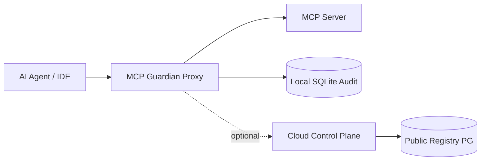

# MCP Security Reference Architecture

Concise reference for how MCP Guardian layers security across agents, the proxy, and optional cloud services.

## Trust boundaries

| Zone | Responsibility |
|------|----------------|
| **Agent** | Issues `tools/call`, `resources/read`, `prompts/get` |
| **Proxy** | Policy, semantic gates, DLP, MTX export, session chains |
| **Upstream** | Untrusted MCP server capabilities |
| **Cloud** | Org policy, fleet radar, public certification/MTX/benchmark hub |

## Request path (tools/call)

1. Transport receives JSON-RPC (stdio / HTTP / SSE / WebSocket).
2. Pre-forward guard — payload limits, agentic hooks.
3. Policy engine — YAML rules, rate limits.
4. Semantic gate — optional LLM/heuristic on arguments.
5. Forward to upstream (if allowed).
6. Response gate — DLP, resource/prompt poisoning checks.
7. Audit persist + optional MTX signature contribution.

## Industry-standard surfaces

| Surface | Local (dashboard) | Hosted (cloud) |
|---------|-------------------|----------------|
| Certifications | `GET /api/certification/registry` | `GET/POST /api/v1/certifications` |
| Attestation verify | — | `GET /api/v1/certifications/verify/:id` |
| MTX | SQLite `mtx_signatures` | `POST /api/v1/mtx/contribute`, `GET /api/v1/mtx/catalog` |
| Benchmarks | `POST /api/benchmark/submit-local` | `POST /api/v1/benchmarks/submit`, `/benchmarks` UI |
| Policy what-if | `POST /api/policy/simulate` | Org policy via `/api/v1/policy` |
| Feature status | `GET /api/industry-standard/status` | Migration `010_industry_standard.sql` |

## Certification levels

Automated checks produce Bronze → Platinum levels from trust, compliance, CVE, auth, transport, and publisher signals. Attestations use `GUARDIAN-CERT-{LEVEL}-…` tokens or JWS when integrated with external signers.

## Data stores

| Store | Engine | Tables (industry standard) |
|-------|--------|----------------------------|
| Local Guardian | SQLite WAL | `mcp_certifications`, `mtx_signatures`, `benchmark_submissions`, … |
| Cloud hub | PostgreSQL | `public_mcp_certifications`, `public_mtx_catalog`, `public_benchmark_scores` |

## Related docs

- [ARCHITECTURE.md](./ARCHITECTURE.md) — file map and transports
- [MTX_SPEC.md](./MTX_SPEC.md) — threat exchange format
- [POLICY.md](./POLICY.md) — rule authoring
- [SAAS_CONTROL_PLANE.md](./SAAS_CONTROL_PLANE.md) — fleet and org APIs
