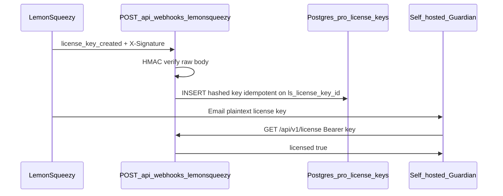

# Lemon Squeezy webhook — Pro license auto-registration

**Status:** Implemented in `apps/cloud`.

## Flow



## Endpoint

`POST /api/webhooks/lemonsqueezy`

- Verifies `X-Signature` (HMAC-SHA256 of **raw** request body) with `LEMONSQUEEZY_WEBHOOK_SECRET`
- Handles `license_key_created` — registers `attributes.key` in `pro_license_keys` (SHA-256 hash with `AUTH_SECRET`)
- Handles `order_refunded` — deletes rows matching `ls_order_id`
- Returns `200` for unknown events (no retry storm)

## Lemon Squeezy dashboard setup

1. **Settings → Webhooks → Add webhook**
2. **URL:** `https://YOUR-APP.vercel.app/api/webhooks/lemonsqueezy`
3. **Events:** `license_key_created`, `order_refunded` (optional but recommended)
4. Copy **Signing secret** → Vercel env `LEMONSQUEEZY_WEBHOOK_SECRET`
5. Optional: **Store ID** → `LEMONSQUEEZY_STORE_ID` (ignore webhooks from other stores)

## Environment variables

| Variable | Required | Purpose |
|----------|----------|---------|
| `LEMONSQUEEZY_WEBHOOK_SECRET` | Yes (for webhook) | HMAC verification |
| `LEMONSQUEEZY_STORE_ID` | No | Filter events by `store_id` |
| `AUTH_SECRET` | Yes | Must match hash used at registration |
| `DATABASE_URL` | Yes | Postgres for `pro_license_keys` |

## Manual fallback

If a webhook fails or you need a backfill:

```bash
DATABASE_URL=postgresql://... AUTH_SECRET=... pnpm cloud:register-pro-key -- \
  --key "PASTE-LS-LICENSE-KEY" --email buyer@example.com
```

See [LEMON_SQUEEZY_SETUP.md](./LEMON_SQUEEZY_SETUP.md) §5.

## Testing

1. Enable LS **test mode** on the webhook
2. Complete a test checkout
3. Confirm a row in `pro_license_keys` with `ls_license_key_id` set
4. `curl -H "Authorization: Bearer YOUR-KEY" https://YOUR-APP/api/v1/license` → `"licensed": true`

## Security notes

- Never log plaintext license keys from webhook payloads
- Rotate `LEMONSQUEEZY_WEBHOOK_SECRET` if leaked (update LS + Vercel)
- `license_key_created` includes the plaintext key — HTTPS only, verify signature on every request
